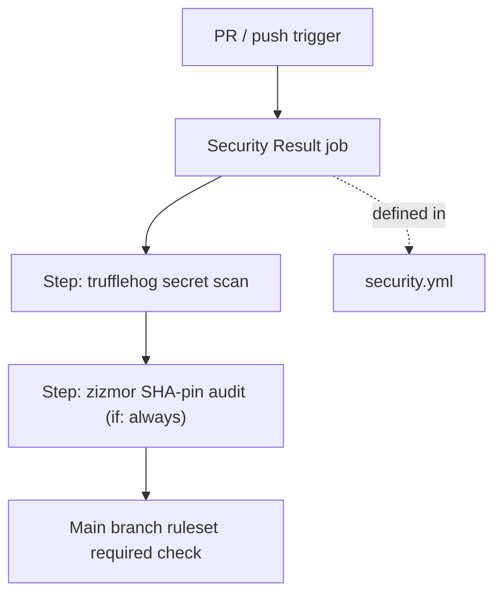
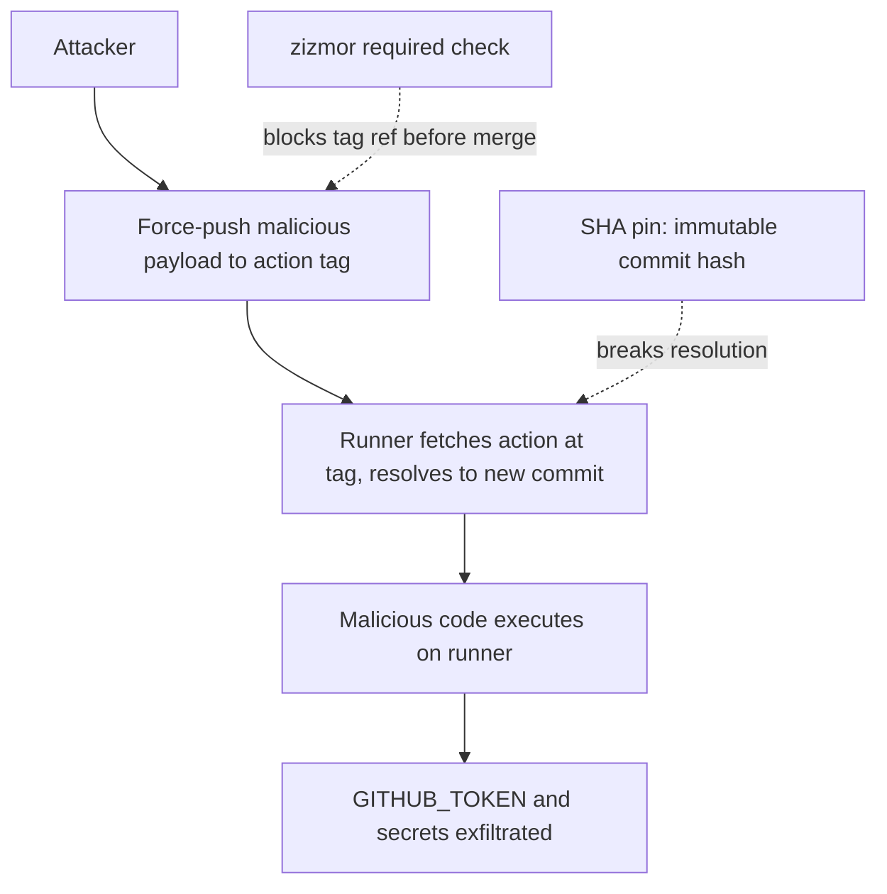

# Repository Standards

This document maps every repo-level artifact to its purpose and the rationale behind non-obvious decisions. It is the checklist for replicating these controls in any repo created from this template.

## Artifact Map

The table below covers all committed configuration artifacts. Issue templates, PR templates, and other non-security files are included for completeness; the security-relevant files are described in depth in [Security Hardening](#security-hardening).

| Path | Purpose | Enforcement |
|------|---------|-------------|
| `AGENTS.md` | AI agent project context scaffold | repo |
| `.github/CODEOWNERS` | Requires `@clouatre` review for changes to `.github/`; replace with your own account or team when adopting this template | repo |
| `.github/copilot-instructions.md` | Copilot-specific agent instructions and PR review checklist | repo |
| `.github/renovate.json` | Automated dependency updates via Renovate | repo |
| `.github/ISSUE_TEMPLATE/` | Structured issue templates | repo |
| `.github/instructions/` | VS Code / Copilot scoped instruction files (applyTo pattern) | repo |
| `.github/PULL_REQUEST_TEMPLATE.md` | PR template | repo |
| `.github/workflows/ci.yml` | Commit message linting (commitlint); single required `Lint Commits` check | repo |
| `.github/workflows/markdown-lint.yml` | Lints all Markdown on pull requests and pushes to `main` with markdownlint-cli2; runs with narrowed `contents: read` permissions | repo |
| `.github/workflows/security.yml` | Sequential trufflehog and zizmor steps in a single required `Security Result` job | repo |
| `.github/workflows/scheduled-security-audit.yml` | Weekly scheduled zizmor security audit | repo |
| `.commitlintrc.yml` | Conventional Commits ruleset for commitlint | repo |
| `.github/workflows/scorecard.yml` | Weekly OpenSSF Scorecard analysis; publishes SARIF to code scanning | repo |
| `.github/workflows/scorecard-publish.yml` | Monthly scorecard.dev publishing via amd64 exception | repo |
| `CONTRIBUTING.md` | Contribution guidelines | repo |
| `SECURITY.md` | Vulnerability disclosure policy | repo |

*Table 1: Committed configuration artifacts and their purpose.*

### AI Agent Context

The artifacts in the map above form a layered context stack for AI coding agents. There are three distinct layers:

- **Ambient context** (`AGENTS.md`, `.github/copilot-instructions.md`, `.github/instructions/`): loaded automatically by agents like goose or GitHub Copilot before any code is generated. Sets project conventions, stack commands, and hard constraints that prevent scope creep and API hallucination.
- **Structured inputs** (`.github/ISSUE_TEMPLATE/`): issue templates force contributors to supply the problem statement, acceptance criteria, and scope boundaries that agents need to scope work correctly. A fully filled issue is sufficient context for an agent assignment; no additional prompting required.
- **Output quality gates** (CI workflows, `.github/PULL_REQUEST_TEMPLATE.md`, `.commitlintrc.yml`, `.github/CODEOWNERS`): automated checks that catch errors an agent might introduce (mutable action refs, exposed secrets, bad commit messages, scope drift) before a human reviewer sees the PR.

Together, the three layers implement what is sometimes called context engineering: structuring the information agents consume so outputs are correct and reviewable by default.

The three files directly involved in security controls are reproduced below for reference when applying these standards to a new repo.

```yaml
name: Security

on:
  pull_request:
    branches:
      - main
  push:
    branches:
      - main

concurrency:
  group: ${{ github.workflow }}-${{ github.ref }}
  cancel-in-progress: true

permissions: {}

jobs:
  security-result:
    name: Security Result
    runs-on: ubuntu-24.04-arm
    timeout-minutes: 10
    permissions:
      contents: read
    steps:
      - name: Checkout
        uses: actions/checkout@3d3c42e5aac5ba805825da76410c181273ba90b1 # v7.0.1
        with:
          fetch-depth: 0

      - name: Scan for committed secrets
        uses: trufflesecurity/trufflehog@bcfcf73aaf4759d4dadc2783177c245a02792318 # v3.97.0
        with:
          extra_args: --only-verified

      - name: Lint GitHub Actions workflows
        if: always()
        uses: zizmorcore/zizmor-action@3dc1ecc9bcb9e94e9b2c709687979e1298497054 # v0.6.2
        with:
          min-severity: medium
          advanced-security: false
```

*Code Snippet 1: `.github/workflows/security.yml` (full file). trufflehog and zizmor run as sequential steps in one job; the zizmor step is marked `if: always()` so it still runs and reports independently even if the trufflehog step fails.*

```
.github/ @clouatre

```

*Code Snippet 2: `.github/CODEOWNERS`. Replace `@clouatre` with your own account or team when adopting this template.*

```json
{
  "$schema": "https://docs.renovatebot.com/renovate-schema.json",
  "extends": ["config:best-practices"],
  "labels": ["dependencies"],
  "minimumReleaseAge": "3 days",
  "platformAutomerge": true,
  "dependencyDashboard": false,
  "schedule": ["before 6am on monday"],
  "timezone": "UTC",
  "packageRules": [
    {
      "groupName": "non-major",
      "matchUpdateTypes": ["patch", "minor", "digest", "pin", "lockFileMaintenance"],
      "automerge": true
    },
    {
      "groupName": "github-actions",
      "matchManagers": ["github-actions"],
      "matchUpdateTypes": ["major", "minor", "patch", "digest", "pin", "lockFileMaintenance"],
      "automerge": true
    }
  ]
}
```

*Code Snippet 3: `.github/renovate.json`.*

## Non-obvious Decisions

**Single `Security Result` job.** The main branch ruleset requires one status check named `Security Result`; both security controls (trufflehog, zizmor) run as sequential steps inside this one job rather than as separate jobs feeding an aggregator. The zizmor step is marked `if: always()` so it still runs and reports independently even if the trufflehog step fails; GitHub computes the job's overall pass/fail natively from step results, so no separate shell-based result-check step is needed. This keeps the ruleset stable the same way an aggregator design would: adding or removing a security tool requires only a change within `security.yml`, not an admin-only ruleset edit. Ruleset edits require admin access and are not tracked in git, so minimizing them reduces operational risk.

**Job-count consolidation (`ci.yml`, `security.yml`).** On a small repo, real per-check compute is seconds, but each GitHub Actions job pays a fixed VM-boot-and-checkout cost regardless of how little work it does. The original design used 7 jobs per PR (`commitlint` → `check-base` → `ci-result`; `secrets` + `zizmor` → `security-result`; `lint`) to satisfy 3 required status checks. `check-base` (a full-history checkout solely to run `git merge-base` and fail the check if the branch was behind main) was redundant with the branch ruleset's own `strict_required_status_checks_policy: true`, which already enforces branch currency natively at zero Actions cost, so it was deleted outright. `commitlint` was folded directly into the `Lint Commits` job (renamed from `CI Result`, since with `check-base` gone the job no longer aggregates anything and the old name no longer described its single purpose), and `secrets`/`zizmor` were folded into sequential steps of the `Security Result` job. Net effect: 7 billed jobs per PR down to 3, identical protections (DCO sign-off, commit-message linting, secret scanning, workflow SHA-pin linting, branch-currency enforcement), and no ruleset edits beyond the one required-check rename. Trade-off: the GitHub PR Checks tab now shows only `Lint Commits` and `Security Result` rather than a separate entry per underlying tool — diagnosing which step failed means opening the job log instead of scanning the checks list. `check-base`'s custom out-of-date-branch error message is also gone, replaced by GitHub's native "Update branch" UI enforcement (same protection, different UX). See clouatre-labs/3pillar PR #76 for the origin of this pattern.

**trufflehog `--only-verified` flag.** TruffleHog's detector set matches a broad set of patterns and generates false positives on test fixtures, redacted excerpts, and example strings embedded in documentation, which are common in an engagement repo that quotes API responses and config examples. `--only-verified` instructs TruffleHog to attempt live verification against the issuing service before reporting a finding; only credentials confirmed active are surfaced. This keeps the signal-to-noise ratio high enough that the job does not become routine noise to bypass.

**Why TruffleHog over gitleaks.** `gitleaks/gitleaks-action` requires a `GITLEAKS_LICENSE` org secret for any repo belonging to a GitHub organisation (a free Starter tier is available but requires registration and adds a per-repo secret-management dependency). TruffleHog's official GitHub Action has no per-organisation licensing gate, making it the practical default for a reusable template targeting organisation-owned repos. The gitleaks CLI itself is MIT-licensed and suitable for local use; the licensing constraint is specific to the `gitleaks-action` wrapper.

**`fetch-depth: 0` for trufflehog.** GitHub Actions clones repos with `--depth 1` by default, exposing only the tip commit. A developer who commits a credential and then removes it in a subsequent commit leaves the secret accessible in the git object store but invisible in a shallow clone. TruffleHog requires the complete commit graph to scan all reachable commits. The zizmor job uses a shallow clone because it only needs the current state of `.github/workflows/`, so no `fetch-depth` override is applied there.

**Read-only default workflow permissions.** GitHub's historical default for new repos grants workflows `contents: write` implicitly via `GITHUB_TOKEN`. Any workflow step running attacker-controlled code (via script injection or a compromised action) can use that token to push commits, create releases, or approve PRs without any additional credential. Setting the default to `read` at the repo level means every workflow that needs elevated access must declare it explicitly in the workflow file, making the privilege visible in code review. Any workflow requiring write operations (e.g. a release workflow with `contents: write`, `id-token: write`, and `attestations: write`) must declare those permissions explicitly at the job level.

**Action allowlist.** Setting the repo to `selected` actions mode means only `actions/*`, `github/*`, and the named third-party patterns can be used in any workflow. A contributor who wants to add a new third-party action must update both the workflow file and the allowlist in the same PR, creating two review gates. Without the allowlist, adding an unreviewed action requires only a single workflow edit. `github_owned_actions: true` covers all `actions/*` and `github/*` namespaces without listing them individually.

**CODEOWNERS scope: `.github/`.** Requiring `@clouatre` review for all files under `.github/` prevents a contributor from modifying workflow files, CODEOWNERS itself, or the renovate config without owner review. All files under `.github/` (including `.github/renovate.json`) are covered by a single CODEOWNERS entry.

**`subject-case`, `body-max-line-length`, and `footer-leading-blank` disabled in `.commitlintrc.yml`.** `@commitlint/config-conventional` enforces lowercase commit subjects, a 100-character body line limit, and a blank line before the footer, but none of these rules are part of the Conventional Commits spec; all are opinions layered on top by the preset. Every automated tool in the ecosystem (Dependabot, Renovate, release-please, GitHub Copilot) generates sentence-case subjects (e.g. "Bump the actions group with 2 updates") and embeds full changelogs in commit bodies that routinely exceed 100 characters. `footer-leading-blank` is cosmetic and not in the spec. These three rules are disabled at severity 0 so bot-generated commits pass CI without whitelisting individual actors. All structural rules remain enforced: `type-enum`, `type-case`, `scope-case`, `header-max-length`, `body-leading-blank`, and `subject-full-stop`.

**Runner pinning to ubuntu-24.04-arm.** `ubuntu-latest` is a moving alias; GitHub advances it to the next LTS image with short notice. Pinning to a specific image (`ubuntu-24.04-arm`) makes toolchain changes explicit and reviewable rather than silent. The `-arm` suffix selects GitHub's ARM64 runner fleet, which provides equivalent performance to x86 at lower cost and avoids contention on the oversubscribed x86 pool. Renovate keeps the pin current via automated PRs.

**Permissions-first sequencing.** The org default GITHUB_TOKEN permission was flipped to `read` on 2026-03-25. New repos work without per-workflow blocks, but explicit blocks are still required as defence in depth and should be placed before the first `jobs:` key by convention for readability. Per-workflow pattern for CI: `contents: read` / `pull-requests: read`. Minimum required permissions set per job; jobs using `actions/checkout` need at least `contents: read`.

## Applying to a Sibling Repo

These steps replicate all controls to any new engagement repo under `github.com/clouatre-labs`. Complete them in order; later steps depend on earlier ones being in effect.

1. Copy `.github/CODEOWNERS`, `.github/renovate.json`, `.github/workflows/security.yml`, `.github/workflows/scheduled-security-audit.yml`, `.github/workflows/scorecard.yml`, and `.github/workflows/scorecard-publish.yml` into the new repo. Add any additional third-party action patterns the new repo uses to the allowlist in step 4.

2. Update the owner in `CODEOWNERS`. Replace `@clouatre` with your own GitHub account or team. **Critical:** Ensure that account or team has at least `Write` access to the derived repo. GitHub silently ignores code owners that lack write access, which would leave `.github/` unprotected. Update the absolute contact URLs in `.github/ISSUE_TEMPLATE/config.yml` to point to the derived repo. See `.github/CODEOWNERS` for the full comment block.

3. Set default workflow permissions to read-only. This limits the blast radius of any compromised workflow step.

   ```bash
   gh api \
     --method PUT \
     -H "Accept: application/vnd.github+json" \
     -H "X-GitHub-Api-Version: 2022-11-28" \
     /repos/{org}/{repo}/actions/permissions/workflow \
     -f default_workflow_permissions=read \
     -F can_approve_pull_request_reviews=false
   ```

   *Code Snippet 5: Set default workflow permissions to read-only.*

4. Restrict allowed actions. Run both calls: the first switches the repo into `selected` mode; the second sets the explicit allowlist.

   ```bash
   gh api \
     --method PUT \
     -H "Accept: application/vnd.github+json" \
     -H "X-GitHub-Api-Version: 2022-11-28" \
     /repos/{org}/{repo}/actions/permissions \
     -f enabled=true \
     -f allowed_actions=selected
   ```

   *Code Snippet 6: Switch to selected-actions mode.*

   ```bash
   gh api \
     --method PUT \
     -H "Accept: application/vnd.github+json" \
     -H "X-GitHub-Api-Version: 2022-11-28" \
     /repos/{org}/{repo}/actions/permissions/selected-actions \
     -F github_owned_actions=true \
     -F verified_allowed=false \
     --field 'patterns_allowed[]=DavidAnson/markdownlint-cli2-action@*' \
     --field 'patterns_allowed[]=trufflesecurity/trufflehog@*' \
     --field 'patterns_allowed[]=zizmorcore/zizmor-action@*' \
     --field 'patterns_allowed[]=ossf/scorecard-action@*'
   ```

   *Code Snippet 7: Set the selected-actions allowlist. Add entries for any additional third-party actions the new repo uses.*

5. Copy `.commitlintrc.yml` and add the `lint-commits` job to `ci.yml`. Set `Lint Commits` as a required status check in the branch ruleset alongside `Security Result` and `Lint markdown`. Do not add a separate branch-currency ("check-base") job — the ruleset's `strict_required_status_checks_policy: true` (Code Snippet 10) already enforces that the branch is up to date with main before merge, at zero Actions cost; a dedicated job to re-check it is redundant.

   ```yaml
   lint-commits:
     name: Lint Commits
     runs-on: ubuntu-24.04-arm
     timeout-minutes: 5
     permissions:
       contents: read
     steps:
       - name: Checkout
         uses: actions/checkout@3d3c42e5aac5ba805825da76410c181273ba90b1 # v7.0.1
         with:
           fetch-depth: 0
       - name: Set up Node.js
         uses: actions/setup-node@820762786026740c76f36085b0efc47a31fe5020 # v7.0.0
         with:
           node-version: "24"
       - name: Cache npm
         uses: actions/cache@55cc8345863c7cc4c66a329aec7e433d2d1c52a9 # v6.1.0
         with:
           path: ~/.npm
           key: commitlint-${{ hashFiles('.commitlintrc.yml') }}
           restore-keys: commitlint-
       - name: Install commitlint
         run: |
           npm install --no-save \
             @commitlint/cli@21.2.1 \
             @commitlint/config-conventional@21.2.0
       - name: Validate commit messages
         run: |
           npx commitlint \
             --from ${{ github.event.pull_request.base.sha }} \
             --to ${{ github.event.pull_request.head.sha }} \
             --verbose
   ```

   *Code Snippet 8: `lint-commits` job for `ci.yml`.*

6. Find the existing main branch ruleset ID and apply the full ruleset body. The `PUT` call replaces all rules atomically.

   ```bash
   RULESET_ID=$(gh api /repos/{org}/{repo}/rulesets \
     --jq '.[] | select(.name=="Protect main branch") | .id')
   ```

   *Code Snippet 9: Retrieve the ruleset ID by name.*

   Save the following as `ruleset.json`, adapting the `name` field if the existing ruleset has a different name:

   ```json
   {
     "name": "Protect main branch",
     "target": "branch",
     "enforcement": "active",
     "conditions": {
       "ref_name": { "include": ["refs/heads/main"], "exclude": [] }
     },
     "rules": [
       {
         "type": "pull_request",
         "parameters": {
           "required_approving_review_count": 0,
           "dismiss_stale_reviews_on_push": false,
           "require_code_owner_review": false,
           "require_last_push_approval": false,
           "allowed_merge_methods": ["squash"]
         }
       },
       { "type": "non_fast_forward" },
       { "type": "deletion" },
       { "type": "required_signatures" },
       {
         "type": "commit_message_pattern",
         "parameters": {
           "name": "DCO Sign-off",
           "operator": "contains",
           "pattern": "Signed-off-by:",
           "negate": false
         }
       },
       {
         "type": "required_status_checks",
         "parameters": {
           "required_status_checks": [
             { "context": "Security Result", "integration_id": null },
             { "context": "Lint Commits", "integration_id": null },
             { "context": "Lint markdown", "integration_id": null }
           ],
           "strict_required_status_checks_policy": true
         }
       }
     ],
     "bypass_actors": [
       { "actor_id": 5, "actor_type": "RepositoryRole", "bypass_mode": "pull_request" }
     ]
   }
   ```

   *Code Snippet 10: Full `ruleset.json`. `integration_id: null` lets GitHub resolve the status-check provider. `actor_id: 5` is the built-in Admin repository role. If no existing ruleset exists, use `--method POST /repos/{org}/{repo}/rulesets` and omit `$RULESET_ID`.*

   Squash merges are the only permitted strategy: merge commits produce noisy history and make bisect harder; rebase merges allow individual commits to bypass the PR review surface. With squash-only enabled, each PR produces exactly one commit on `main`, and the `delete_branch_on_merge` repository setting removes the source branch automatically after merge.

   ```bash
   gh api \
     --method PUT \
     -H "Accept: application/vnd.github+json" \
     -H "X-GitHub-Api-Version: 2022-11-28" \
     "/repos/{org}/{repo}/rulesets/$RULESET_ID" \
     --input ruleset.json
   ```

   *Code Snippet 11: Apply the ruleset via PUT.*

7. Enable Copilot code review via the `copilot_code_review` ruleset rule. Add it to the ruleset JSON under `rules` and PUT the updated ruleset. Parameters: `review_on_push: true`, `review_draft_pull_requests: false`. Alternatively enable via Settings > Copilot > Code reviews.

   Once enabled, Copilot automatically reviews PRs on push. See `.github/copilot-instructions.md` for details on requesting re-reviews.

   ```json
   {
     "type": "copilot_code_review",
     "parameters": {
       "review_on_push": true,
       "review_draft_pull_requests": false
     }
   }
   ```

   *Code Snippet 12: Copilot code review ruleset rule.*

8. Open a PR with the copied files and merge it. Verify that the `Security Result` and `Lint Commits` checks appear and pass on the next PR. If the allowlist is incomplete, the security workflow will fail at job queue time with an action-not-allowed error before any code runs.

9. Enable `allow_auto_merge` so Renovate's `platformAutomerge: true` setting (Code Snippet 3) can queue merges once required checks pass. This is a repo setting, not tracked in git.

   ```bash
   gh api \
     --method PATCH \
     -H "Accept: application/vnd.github+json" \
     -H "X-GitHub-Api-Version: 2022-11-28" \
     /repos/{org}/{repo} \
     -f allow_auto_merge=true
   ```

   *Code Snippet 19: Enable `allow_auto_merge`.*

## Security Hardening

Two layers of defense protect the repo against the attack patterns most relevant to a GitHub-hosted engagement repo: secret exfiltration from commit history and supply chain compromise via mutable action references. Both controls run as sequential steps inside a single job on every PR and push to main, reporting as one required status check.



*Figure 1: Security workflow steps. Two sequential steps inside a single job report as the sole required status check on the main branch; the zizmor step runs with `if: always()` so it still executes and reports independently even if the trufflehog step fails.*

### Control 1: Secret Scanning (trufflehog)

**Attack mitigated:** Committed credential exfiltration. In the 2021 Codecov breach, attackers modified the Codecov bash uploader script to read environment variables (including CI tokens and any credentials present in the environment) and transmit them to an attacker-controlled server. Any CI pipeline that downloaded and executed the uploader was compromised. Beyond supply chain injection, the more common pattern is a developer accidentally committing an API key and then removing it in a subsequent commit; the credential remains accessible in the git object store and is invisible in a shallow clone but fully readable in the complete history. TruffleHog with `fetch-depth: 0` scans every reachable commit; `--only-verified` confirms each candidate is still an active credential before alerting, keeping the false positive rate low.

```yaml
- name: Checkout
  uses: actions/checkout@3d3c42e5aac5ba805825da76410c181273ba90b1 # v7.0.1
  with:
    fetch-depth: 0

- name: Scan for committed secrets
  uses: trufflesecurity/trufflehog@6f3c981e7b77f235fd2702dd74af25fc4b72bf11 # v3.96.0
  with:
    extra_args: --only-verified
```

*Code Snippet 13: trufflehog checkout and scan steps from `security.yml`.*

### Control 2: SHA-Pin Audit (zizmor)

**Attack mitigated:** Mutable action tag substitution. In March 2025, attackers compromised the `tj-actions/changed-files` GitHub Actions repository and force-pushed a credential-harvesting payload to the `v35` tag. Every workflow using `uses: tj-actions/changed-files@v35` immediately began running the attacker's code on their runners, exfiltrating `GITHUB_TOKEN` and other secrets. Pinning to a full commit SHA makes the reference immutable: a tag move has no effect because the runner fetches the exact commit, not whatever the tag currently points to. zizmor scans all workflow files for tag references (and other misconfigurations) and fails the check before the PR can merge, blocking the introduction of any mutable reference.



*Figure 2: SHA-pinning attack chain and mitigations. Dashed edges show where each control breaks the chain.*

```yaml
- name: Lint GitHub Actions workflows
  uses: zizmorcore/zizmor-action@3dc1ecc9bcb9e94e9b2c709687979e1298497054 # v0.6.2
  with:
    min-severity: medium
    advanced-security: false
```

*Code Snippet 14: zizmor step from `security.yml`. `min-severity: medium` suppresses informational noise. `advanced-security: false` uses GitHub annotations (no Code Scanning dependency); findings appear as PR annotations and fail the job. To enable persistent SARIF uploads via Code Scanning, set `advanced-security: true` and add `security-events: write` and `actions: read` permissions, but note that Code Security must be enabled at the repo or org level.*

### Control 3: Single Security Result Job

**Rationale:** If each security control were required individually in the branch ruleset, adding, removing, or renaming a tool would require an admin-only ruleset edit that is not tracked in git. Instead, both controls run as sequential steps inside one job named `Security Result`, which is the only required check. The zizmor step is marked `if: always()` so it still runs and reports independently even if the trufflehog step fails; GitHub computes the job's overall pass/fail natively from step results, so there is no separate shell-based result-check step to maintain. Adding a third security tool later means adding another step to this job, not a new required check.

```yaml
security-result:
  name: Security Result
  runs-on: ubuntu-24.04-arm
  timeout-minutes: 10
  permissions:
    contents: read
  steps:
    - name: Checkout
      uses: actions/checkout@3d3c42e5aac5ba805825da76410c181273ba90b1 # v7.0.1
      with:
        fetch-depth: 0
    - name: Scan for committed secrets
      uses: trufflesecurity/trufflehog@bcfcf73aaf4759d4dadc2783177c245a02792318 # v3.97.0
      with:
        extra_args: --only-verified
    - name: Lint GitHub Actions workflows
      if: always()
      uses: zizmorcore/zizmor-action@3dc1ecc9bcb9e94e9b2c709687979e1298497054 # v0.6.2
      with:
        min-severity: medium
        advanced-security: false
```

*Code Snippet 15: `security-result` job body from `security.yml`, showing the sequential trufflehog and zizmor steps.*

### Control 4: Read-Only Default Workflow Permissions

**Attack mitigated:** GITHUB_TOKEN abuse. When a workflow step executes attacker-controlled code (via script injection or a compromised action), it inherits the `GITHUB_TOKEN` injected by GitHub. With write permissions (the historical repo default), that token can push commits, create or modify releases, and approve pull requests without any additional credential. Setting the default to `read` at the repo level limits the blast radius: only jobs that explicitly declare elevated permissions can perform write operations, and those declarations are visible in code review. The `markdown-lint.yml` lint job required an explicit declaration because it had previously been silently inheriting the write default:

```yaml
jobs:
  lint:
    runs-on: ubuntu-24.04-arm
    permissions:
      contents: read
```

*Code Snippet 16: Explicit `permissions: contents: read` added to the `lint` job in `.github/workflows/markdown-lint.yml`. Without this declaration the job inherited the repo-level write default.*

The API call to apply the repo-level setting is in Code Snippet 5.

### Control 5: Action Allowlist

**Attack mitigated:** Unreviewed third-party action pull-in and dependency confusion. Without an allowlist, a contributor can add `uses: attacker/exfil-action@v1` to any workflow in a single diff that, once merged, runs with the repo's token and environment. With the repo in `selected` mode, that workflow change fails at job queue time with an action-not-allowed error; the allowlist must also be updated in the same PR, creating a second explicit review gate for any new action. Adding a new tool therefore requires two visible diffs reviewed by CODEOWNERS: the workflow change and the allowlist change. The API calls to apply this setting are in Code Snippets 6 and 7.

### Control 6: Code Owner Review

**Attack mitigated:** Unauthorized workflow modification. An attacker or compromised contributor with write access to the repo could edit `.github/workflows/` to add a secret exfiltration step, modify CODEOWNERS to remove the review requirement, or suppress zizmor rules to allow tag-pinned actions through. The CODEOWNERS file (Code Snippet 2) requires `@clouatre` approval for all changes under `.github/`, which now includes `.github/renovate.json`.  The admin bypass actor uses `bypass_mode: pull_request` so every merge goes through a PR and is logged in the audit trail.

**Solo-maintainer note.** When `require_code_owner_review: true` and `required_approving_review_count: 0` are both set, GitHub requires the code owner's approval but does not count a self-approval from the PR author. On a single-owner repo, this means the owner cannot merge their own `.github/` PRs without invoking the Admin bypass. That is the intended escape hatch: the bypass is logged in the audit trail, making the exception visible. Adopters who have a team should set `required_approving_review_count: 1` in addition to `require_code_owner_review: true` to enforce a full second-eye review.

**Optional extension: `required_reviewers` in the ruleset.** GitHub Rulesets GA'd a `required_reviewers` field inside the `pull_request` rule parameters in February 2026. It accepts a list of teams with associated file glob patterns and a `minimum_approvals` count, enforcing mandatory review by a specific team for PRs that touch matching paths, independently of CODEOWNERS.

This is useful when a second team (for example, a security team or a platform team) must approve changes to a specific path (for example, `infra/terraform/**` or `**/secrets/**`) in addition to the primary CODEOWNERS check. The two mechanisms compose: both the CODEOWNERS requirement and any `required_reviewers` entries must be satisfied before merge.

Prefer CODEOWNERS for primary review policy. CODEOWNERS is a committed file: changes to who reviews what are visible in PRs, tracked in git history, and subject to CODEOWNERS review themselves. `required_reviewers` lives only in the ruleset, which is not tracked in git and requires admin access to modify. Reserve `required_reviewers` for secondary teams that need mandatory sign-off but are not the primary owner of a path.

```json
"required_reviewers": [
  {
    "reviewer": { "id": 12345, "type": "Team" },
    "file_patterns": ["infra/terraform/**"],
    "minimum_approvals": 1
  }
]
```

*Code Snippet 18: `required_reviewers` inside the `pull_request` rule parameters. Replace `12345` with the team numeric `id` (not `node_id`) from `gh api /orgs/{org}/teams/{slug}`. The field is GA as of 2026-02-17.*

### Control 7: SHA-Pin Maintenance (Renovate)

**Attack mitigated:** Stale SHA pin pointing to a version that predates a supply chain fix or contains a known CVE. A SHA pin is only as safe as the commit it references; if that commit predates a security patch, the pin perpetuates the vulnerability. Renovate opens a weekly PR grouping all `github-actions` pin updates into a single reviewable diff (Code Snippet 3), gated by a 3-day `minimumReleaseAge` so a newly published or force-pushed release has time to be caught before it reaches this repo. The grouped cadence prevents update fatigue from individual per-action PRs. Renovate PRs that touch `.github/renovate.json` are subject to CODEOWNERS review, maintaining the team-approval requirement for all security-adjacent config changes.

#### Auto-merge for GitHub Actions updates

The repository enables auto-merge for Renovate PRs that update GitHub Actions pins only. This is handled entirely by Renovate's own configuration; no custom workflow is required.

**Configuration (`renovate.json`).** The `github-actions` `packageRules` entry (Code Snippet 3) matches all `github-actions` update types and sets `automerge: true`; combined with the top-level `platformAutomerge: true`, Renovate enables GitHub's native pull request auto-merge on qualifying PRs it opens, so the merge is queued the same way a human clicking "Enable auto-merge" would queue it, and executes once required checks pass. The `non-major` `packageRules` entry provides the same behavior for any non-GitHub-Actions manager this repo later adds, but only for patch/minor/digest/pin/lockfile-maintenance updates; major updates always require manual review.

**Bypass actor in the ruleset.** The bootstrap snippet grants the built-in Admin repository role (`actor_id: 5`) a `pull_request` bypass. If a Renovate bypass is needed for auto-merge to complete without a human review, configure it explicitly and document that exception. A bypass actor can merge without satisfying rules such as `require_code_owner_review`, required status checks, DCO sign-off (`commit_message_pattern: Signed-off-by:`), GPG signatures (`required_signatures`), and the `non_fast_forward` and `deletion` protections on `main`. Other protections that are not implemented via this ruleset continue to apply as configured.

Renovate runs as a first-party GitHub App (`renovate[bot]`), not a third-party contributor. Its PRs contain only automated SHA pin bumps generated from the current upstream tag and are not intended as a vector for script injection or credential exfiltration. Risk is reduced by scoping automerge at the `packageRules` level to `patch`/`minor`/`digest`/`pin`/`lockFileMaintenance` update types only; major updates are never auto-merged and proceed through the normal review and approval flow. If the Renovate GitHub App is configured as a ruleset bypass actor, that exception must be reviewed separately.

The `allow_auto_merge` repository setting is enabled to permit `platformAutomerge` to queue the merge after all required checks pass (Code Snippet 19). Auto-merge does not bypass status checks; it simply queues the merge operation to execute once the checks succeed.

## Controls Not Covered (Require Org Admin)

The following controls cannot be applied at the repo level. They require org admin rights. Raise these with whoever holds org admin access.

| Control | Why it matters | Enforcement Path |
|---------|---------------|------------------|
| Org-wide `default_workflow_permissions=read` | Covers all repos where no one runs the per-repo API call; a new repo silently inherits write permissions without it | Org admin: GitHub org settings > Actions > Workflow permissions |
| Org-wide `sha_pinning_required=true` | Enforces SHA pins at job queue time via runner policy, not just via the zizmor CI check, which can be bypassed by deleting the security workflow | Org admin: GitHub org-level ruleset or runner policy |
| Org-wide fork PR approval policy | Prevents untrusted code from external forks running on org-hosted runners and accessing org secrets | Org admin: GitHub org settings > Actions > Fork pull request workflows |
| Tag immutability org ruleset | Blocks tag force-push attacks (the Trivy breach pattern: attacker moved a release tag to point to malicious code); immutable tags make SHA pinning meaningful | Org admin: GitHub org-level ruleset with tag target and `non_fast_forward` + `deletion` rules |
| trufflehog GitHub App | App-level secret detection runs regardless of workflow state; the CI-only trufflehog check can be bypassed by deleting or disabling the security workflow | Org admin or owner: GitHub App installation on org |
| DCO GitHub App | App-level DCO enforcement with per-commit UI feedback; the current `commit_message_pattern` rule enforces DCO at push but the App provides richer status and contributor guidance | Org admin or owner: GitHub App installation on org |
| 2FA enforcement | Account takeover baseline; without 2FA a credential-stuffing attack can push directly to any repo the compromised account can access | Org admin: GitHub org settings > Security > Authentication. Status unverified; requires org owner to confirm at Settings > Security > Authentication |

*Table 2: Controls requiring org admin access, with rationale and enforcement path.*

## Summary

| # | Control | Attack or Risk Blocked | Enforcement Path |
|---|---------|----------------------|-----------------|
| 1 | Secret scanning (trufflehog) | Committed credential exfiltration; secrets pushed to history then scraped (Codecov breach pattern) | `security.yml` trufflehog step (job `security-result`); required via Security Result status check on main branch ruleset |
| 2 | SHA-pin audit (zizmor) | Mutable action tag substitution; attacker moves tag to malicious code (tj-actions/changed-files pattern) | `security.yml` zizmor step (job `security-result`); required via Security Result status check on main branch ruleset |

*Table 3: Security hardening summary.*
